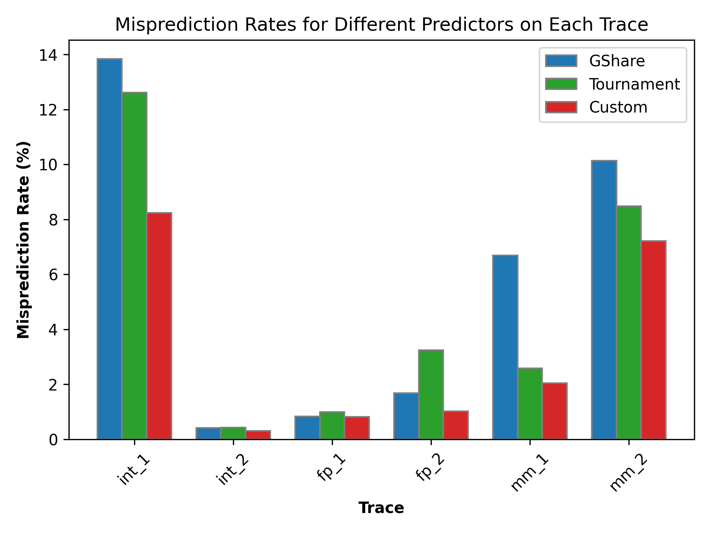

# CSE 240A Winter 2024 Branch Predictor Project

A Comparative analysis project undertaken as part of the CSE 240A course at UCSD in Winter '2024, evaluating performance of ``Gshare:13``, ``Tournament:9:10:10`` and a custom Perceptron predictor implemented based on the paper [Dynamic Branch Prediction with Perceptrons](https://www.cs.utexas.edu/~lin/papers/hpca01.pdf). Results show the prediction superiority of the implemented custom perceptron predictor over the baselines across all test traces while not excedding the specified memory limits. 

# Overview:

In computer architecture, pipelines are vital for minimizing instruction latency by overlapping multiple instructions during execution. However, encountering branch instructions can cause pipeline stalls, resulting in wasted CPU cycles and decreased performance. Branch predictors aim to mitigate this issue by forecasting the next instruction's address, allowing uninterrupted pipeline execution. Despite their benefits, inaccuracies in predictions can lead to wasted cycles and performance penalties. To address this, various predictors like GShare, tournament, and perceptron have been developed. 

In this project, we implemented a GShare predictor, a tournament predictor inspired by Alpha 21264, and a custom perceptron predictor. Our custom predictor demonstrated superior performance in branch prediction accuracy compared to GShare:13 and Tournament:9:10:10 predictors, while utilizing memory no larger than 64K + 256 bits.

The results obtained in the above mentioned approaches across traces are represented in the figure below. 

# Project Structure: 

* The project is organized into two main directories: The ``src`` directory contains all the source code in C for all 3 predictors, the makefile, and corresponding execution scripts. The ``report`` directory contains the consolidated raw results from the executed trials and also the ``report/visualizations`` folder contains an interactive Jupyter notebook to generate visualizations and HPO plots for all the experiments mentioned in the Report. Corresponding image files are also present. 

* The ``traces`` directory contains the 6 traces (Integer, Floating point and Memory) across which we evaluate all the 3 implemented predictors to benchmark performance. 

* The ``src/scripts`` directory contains all the scripts necessary to run various experiments for all 3 predictors including the perceptron HPO experiments. 

# How to Run:

* First, in a terminal, navigate to the ``src`` directory and run ``make clean`` followed by ``make all``
* To run **Gshare predictor** and evaluate performance w.r.t varying values of the no. of global history bits (9 - 20) used: 
    - In a terminal navigate to ``src/scripts`` and run ``./run_gshare.sh``
    - To view the raw CLI dump results, you can view them in ``report/gshare_results.txt``
* To run **Tournament predictor** and evaluate performance w.r.t varying configurations of (# global history bits, # local history bits, pcIndex) used: 
    - In a terminal navigate to ``src/scripts`` and run ``./run_tournament.sh``
    - To view the raw CLI dump results, you can view them in ``report/tournament_results.txt``
* To run **Custom Perceptron predictor** and evaluate performance for $\theta = 37$ across traces: 
    - In a terminal navigate to ``src/scripts`` and run ``./run_perceptron.sh``
    - To view the raw CLI dump results, you can view them in ``report/custom_predictor_results.txt``
* To run **Hyper-parameter optimization** for $\theta$ in the perceptron, to check misprediction rate variation w.r.t the threshold:
     - In a terminal navigate to ``src/scripts`` and run ``./perceptron_hpo.sh``
     - To view the raw CLI dump results, you can view them in ``report/perceptron_hpo.txt``
* Lastly, to run all the predictors in the configurations GShare:13, Tournament:9:10:10 and Perceptron:
     - In a terminal navigate to ``src/scripts`` and run ``./run_all.sh``
     - To view the raw CLI dump results, you can view them in ``report/combined_results.txt``

* Now, in order to generate intuitive and simple visualizations from all these CLI dump text/report files, please take a look at ``report/visualizations/generate_visualizations.ipynb``. This python notebook contains straightforward visualizations based on the stats gathered across all the experiments given above. Our report will discuss these plots generated in detail. 

# Acknowledgements:

We'd like to thank Prof. Jishen Zhao and the CSE 240A course staff for their invaluable support and guidance throughout the project, and also, for providing us with the test traces and the skeleton of a simulator in C.

## Team: 

- [Shyam Renjith](mailto:srenjith@ucsd.edu)
- [Aditya Giridharan](mailto:agiridharan@ucsd.edu)